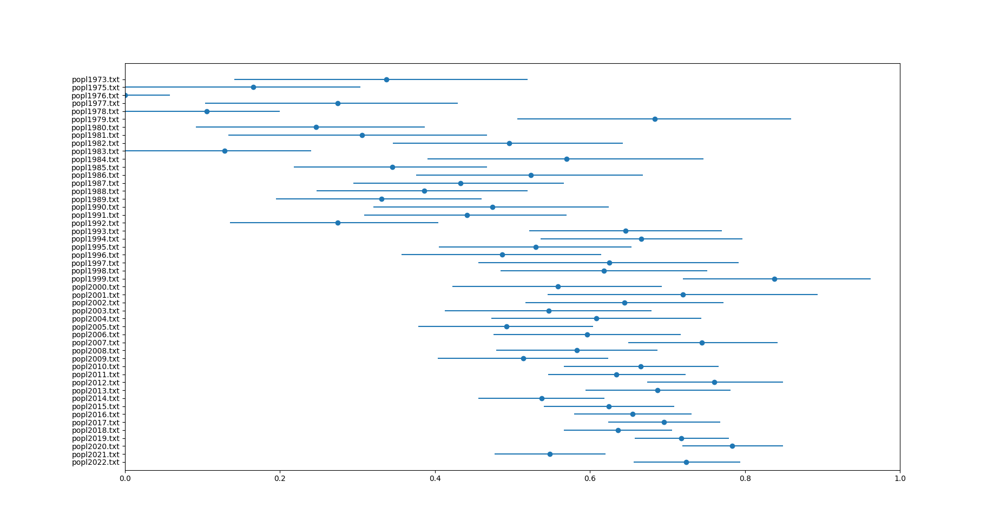

# Analyzing Author Ordering

```
cd popl
rm out.txt
for file in popl*.txt; do python3 ../script.py $file >> out.txt; done
python3 ../plot.py out.txt
```
will run the script on all the author lists for POPL over the years, and plot the results:


