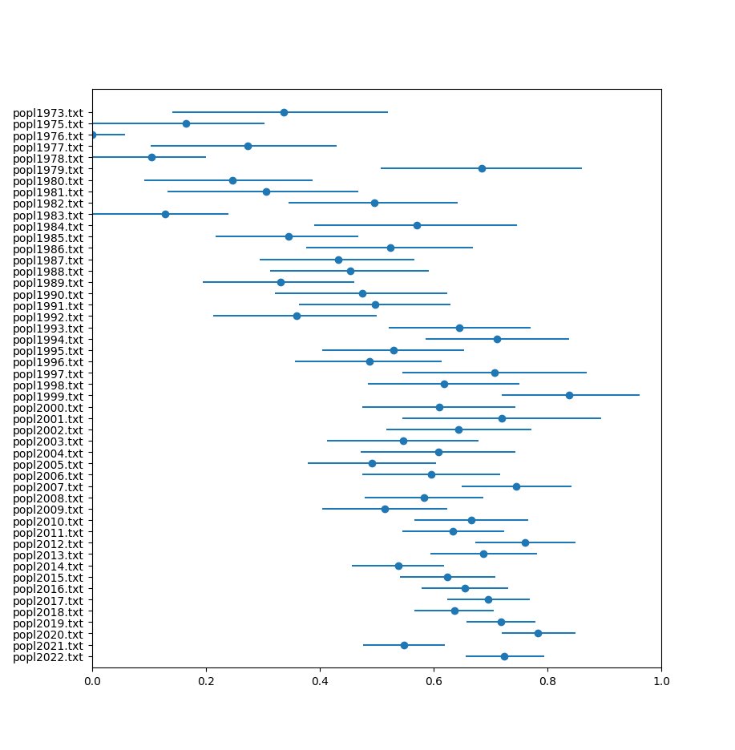

# Analyzing Author Ordering

See [this blog post](https://paulhe.com/2022/12/28/mathematics-or-science.html) for details.

## Usage

For example,
```
cd popl
rm out.txt
for file in popl*.txt; do python3 ../script.py $file >> out.txt; done
python3 ../plot.py out.txt
```
will run the script on all the author lists for POPL over the years, and plot the results:


